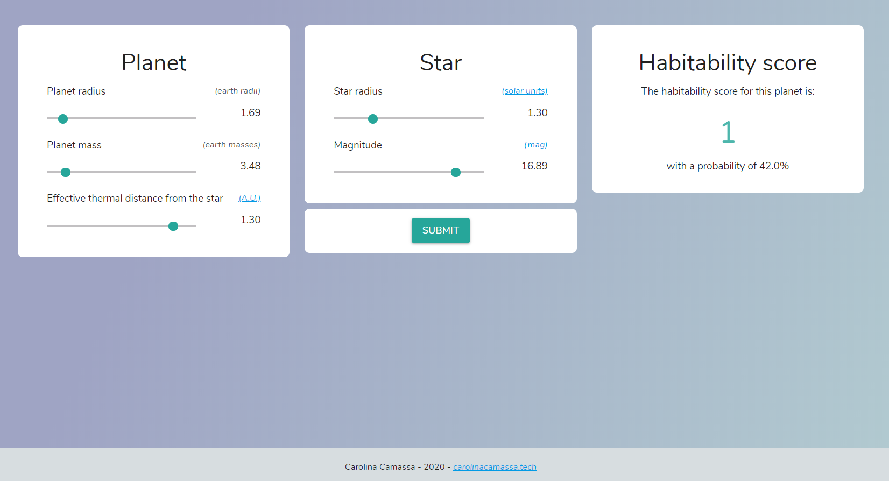

# Creating an interactive Flask app for exoplanet classification

This is the code repository for the following blog post: https://carolinacamassa.tech/blog/posts/flask-ml-app/

I’ve recently stumbled upon [this interesting dataset](http://phl.upr.edu/projects/habitable-exoplanets-catalog/data/database) about **exoplanets**, planets outside our galaxy. There is a lot of ongoing research on this topic, and scientists are making hypothesis on which - if any - of these planets could be considered habitable from the information we’ve gathered about them. I was looking for a small side project to learn how to use the Flask microframework, so I decided to build an app that integrates a machine learning model trained on this data.

## Technologies and packages used:
- Flask to build the app
- *flask-wtf* to include the user input forms
- *pandas*, *numpy* and *scikit-learn* for the machine learning part
- *joblib* to serialize the trained model
- *Tachyons* and *Materialize* as CSS frameworks

Here is what the app looks like:

